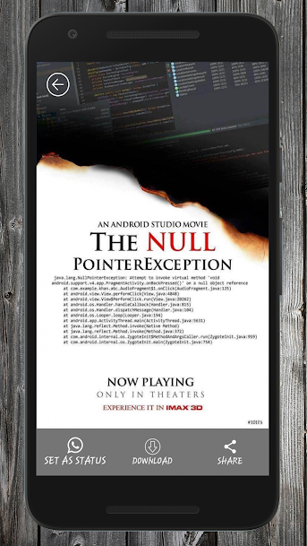

# Status-Saver

#### If you like this project and want to support this project development please support us with a little donation.
#### Please click on the Paypal donate button. Many thanks!

A simple Android Application to download Your contacts Status from whatsapp in a single click.
This app does not require any internet connection.

# ScreenShots

# Library Used

# Note

This app does not gather any kind of data, nor it is affilated by whatsapp, this app is created to for Learning Purpose.

# Contribution

<h3> Feel free to contribute </h3>

<i>For contributing just fork your own repository and checkout as a new branch, commit and then create a pull request with explaining the feature you have added or changed you made<i>

# Contributors

<ol>

<li> <a href="https://github.com/ahrar01"> ahrar01 </a>      </li>
<li>  <a href="https://github.com/Rawkush/"> Rawkush</a>     </li>

</ol>
